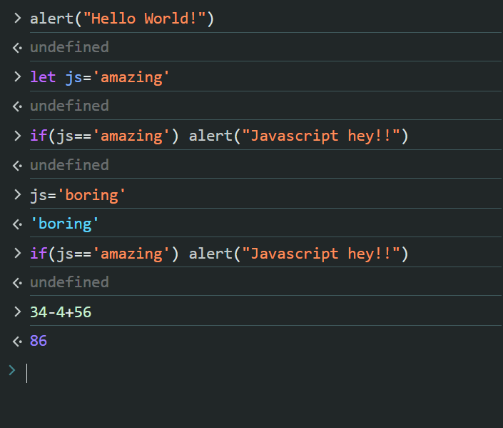
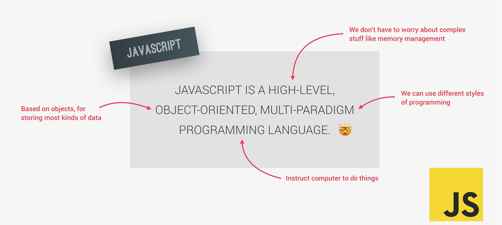
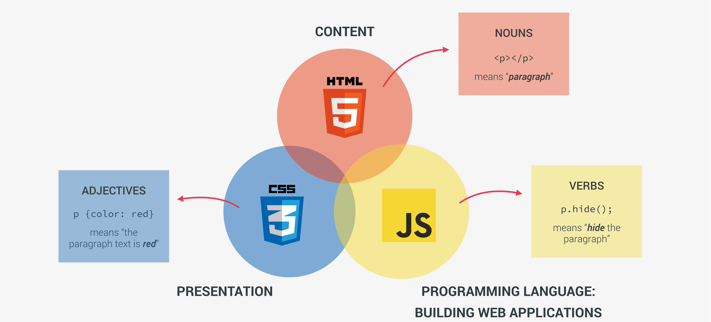
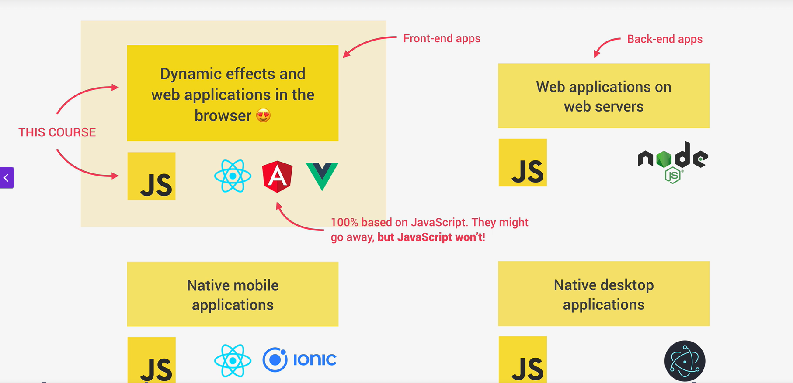

<!-- this is the initial markdown file.... -->

this is the image containing the code we have odone on the broswer control
 this image is purposely depicting what is a Javascript and its features
 this image is depicting the three pillars of web development
 this image is depicting the capabilities of javascript